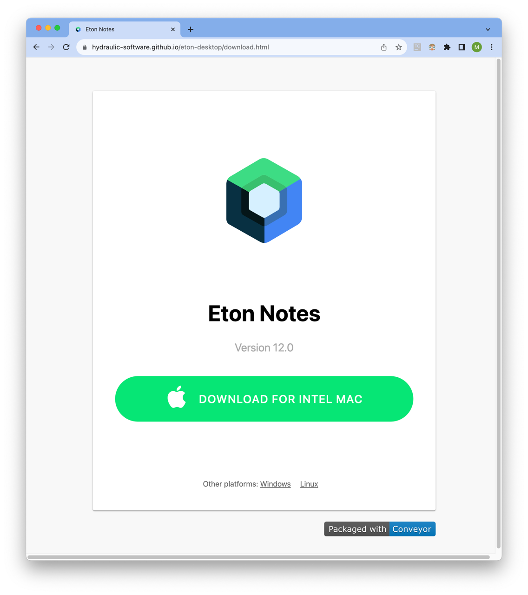

# Download pages

The `site` task will generate the online update repository along with a simple static download page for your software. The download page is entirely optional and can just be ignored if you don't want it. It has these features:

* Detects the user's operating system. Allows the user to switch between operating systems.
* On Chrome, detects the CPU architecture.
* Access to both primary package formats for each platform, and alternatives like raw zips or tarballs.
* Provides copy/pasteable terminal commands to install the app on Linux.
* Shows your app logo.



## Synopsis

```
app.site {
  display-name = Title of the web page.

	# Where the installed packages can check for online updates.
  base-url = somesite.com/downloads

  # Import an HTML template or additional files to the generated site.
  inputs += "my-template-dir/*" -> .
  
  # Change the set of images used for the logo, as found in the resolved inputs.
  icons = "my-icons-*.png"
}
```

## Icon

The `app.site.icons` key works the same way as the other icon keys do (in the `windows`, `mac` and `linux` sections respectively). The default `app.site.inputs` list contains the value of `${app.site.icons}` so you can use alternative file names by just setting the image name here. However, if you have a file named `icon.svg` as an input, it'll be used as the icon instead of the rendered files.

Here's an example of how to import icons from a different directory than the one containing the config and use it at the top of the generated HTML.

```
app.site {
  base-url = downloads.hydraulic.dev/${channel}/compose-sample
  icons = "../../packaging/images/icon-{32,64,128,256}.png"
}
```

## Publishing through GitHub

Conveyor's repository sites are designed to be compatible with GitHub releases. Using them is easy:

1. Set your `app.site.base-url` config key to be `github.com/$user/$repo/releases/latest/download`
2. Run `conveyor make site` as usual to get an output directory.
3. Create a new release and upload the contents of the output directory, minus `download.html` and any extra files you used, like icon files. [Take a look at this example release to see what you should have.](https://github.com/hydraulic-software/compose-music-app/)
4. Take the generated `download.html` file and stick it on your website somewhere.

That's it! To upgrade your users just create a new GitHub release as normal. The auto-update engines will be checking the metadata files on whatever your latest release is to discover what to download.

Be aware of these caveats:

* Your users will upgrade to whatever the `/releases/latest` URL points to. Therefore, you shouldn't do beta releases or other forms of pre-release this way. Stick those files somewhere else or use draft releases, etc.
* The `download.html` file contains links to the "latest" files but their file names will contain the version number. Therefore you should copy the HTML to your website each time you do a release, otherwise users will get 404 errors.

Future versions of Conveyor might automate the process of doing the uploads to GitHub.
