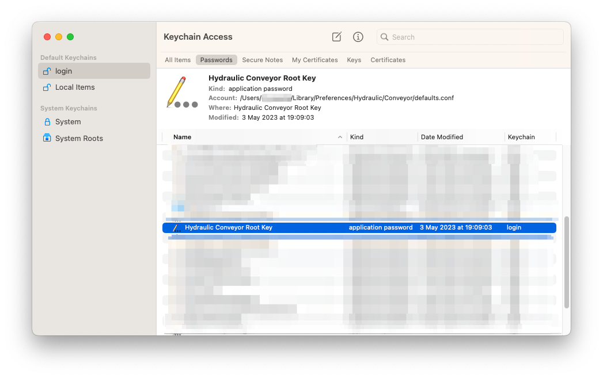
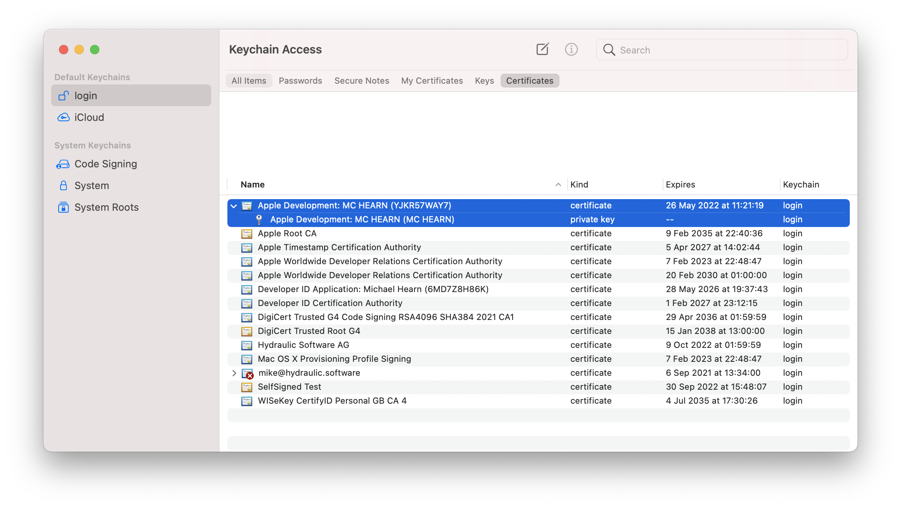
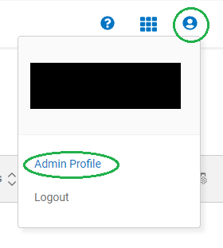
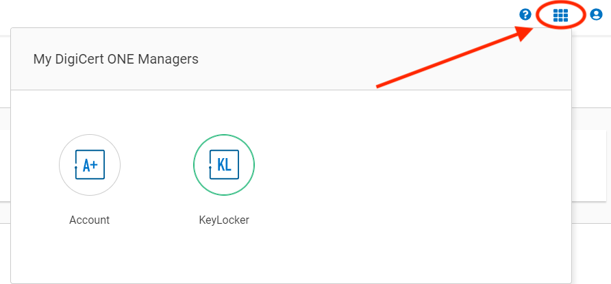

# Keys and certificates

## tl;dr


* **Want to experiment?** [Go straight to the tutorial](../tutorial/new.md). You'll use self-signing for now and can think about certificates later.
* **Already have certificates, or want to buy them?** Read on.

----

## Features

* **Passphrase protection.** You can encrypt your private keys. [See below](#passphrases).
* **Hardware security modules.** You can use private keys protected by physical tokens, remote HSMs and cloud key storage. [See below](#hardware-security-modules).
* **CSR generation**. Conveyor can help you acquire certificates by generating the CSR files you upload to certificate authorities.
* **Safety checks**. Conveyor will do plenty of sanity checking on your certificates to catch common mistakes. It downloads intermediate certificates automatically if you're missing them. 

## Keys in Conveyor

Every operating system uses code signing to establish stable identities for programs that don't change when new versions are released, and to secure the software update process. Windows and macOS additionally use signing as a way to block malware. 

Conveyor therefore needs keys for the following purposes:

1. Signing Windows MSIX packages, and the EXE/DLL files they contain.
2. Signing macOS .app folders.
3. Signing Debian/Ubuntu apt repository files.
4. Signing macOS Sparkle XML update feeds.

These keys are of different types, but fortunately they can all be generated by transforming a single root key without loss of security.

### Root key

Your root private key is an ordinary config setting. [The `defaults.conf` file in your home directory](index.md#per-user-defaults) is
automatically included into every build config, which is why the automatic key generation (`conveyor keys generate`) puts your key there.
However there's nothing special about this file and you can store the signing key anywhere else that config can be loaded from. On macOS,
Conveyor tries to store the root key in the system default login keychain (see [Root Key in Keyring](#macos-root-key-in-keyring) below).

The words form is intended to be easy to write down with a pen and paper. Add line breaks and indentation if you wish using triple quote
syntax (`"""foo"""`). The words contain a checksum so mistakes can be detected quickly.

!!! important
    * Keep your new `defaults.conf` file outside of version control and <u>back it up</u>.
    * The words come from a pre-selected list, so don't try to create a custom sentence.

??? question "Is signing worth it?"
    It's worth signing your code if you are targeting non-developers, or are writing developer tools that might be interfered with by Windows
    anti-virus tools. Conveyor is fully signed because we want it to be as easy to use and robust as possible. Additionally, signing isn't
    security theater. It actually does make malware harder to produce and distribute, which is why modern virus writers put effort into stealing
    signing keys.

    For macOS Apple uses the name on your credit card and you can obtain personal certificates within a few minutes. For Windows you can use any certificate authority, but they may request to see government issued ID. The effort involved in ID verification depends on whether you are signing as a person or as a company. For an organizational certificate you will need to receive a phone call to verify that you are genuinely an employee.

??? info "Making self-signed apps easier to use"
    Although Conveyor removes a lot of the technical effort involved in signing, the best/standard user experiences still require certificates
    to be purchased. Over time we plan to make software distribution easier using sandboxing.

### [macOS] Root key in Keyring

On macOS Conveyor will try to store its root key in the system keyring when you run `conveyor keys generate`. The advantage is that the key
will be protected from other applications trying to read it. Keys are stored under domain `Hydraulic Conveyor Root Key`, and the generated
`defaults.conf` file will contain the line:

```
app.signing-key = "keyring"
```

Because the access is restricted per application and secured with the user's login credentials, only Conveyor will have access to it and so
it's stored without a passphrase. You can directly inspect the contents of the key by using the *Keychain Access* app. The format is exactly
the same that would be written to your `defaults.conf` without a keyring, so if you prefer not using it you can simply copy the value
directly into the setting for `app.signing-key` of your config.

If you already have a root key in your `defaults.conf` and you wish to store it into the system keyring, you can use the following command:

```bash
conveyor keys migrate-to-keyring
```

This command will store your current root key into the keyring and modify your `defaults.conf` in place to point to it. You can always retrieve
your root key back as described above.

### Exporting your root key

There are some situations where you need to retrieve your existing root key (for instance, to set up Conveyor to run in a CI system). 

* In most cases the root key will simply be stored in your [`defaults.conf` file](index.md#per-user-defaults) under the `app.signing-key` config key;
* If the value of `app.signing-key` is set to `keyring`, you'll need to retrieve your root key using the Keychain Access app:
    * Open Keychain Access and locate the `Hydraulic Conveyor Root Key` item under `passwords`:
    
    The `Account` value should be the path to your `defaults.conf` file. 
    * Ctrl-click that item and select "Copy Password to Clipboard". You might be prompted for your keychain password.
    * Paste the copied value where you need it to be.

## Certificates in Conveyor

Certificates link your public key to a verified identity. Conveyor supports the following certificate formats:

* `.cer/.pem` - ASCII encoded. This is sometimes called PEM format.
* `.p12/.pfx` - Binary encoded.
* `.p7b` - ASCII encoded.

When using a `.p12` or `.pfx` file, you must supply [a passphrase](#passphrases).

Usually, certificate authorities give you several options for what format you download them in. When possible pick the option named
something like "PEM with all certificates included". Your certificate file must include not only your own but also any intermediate
certificates.

### If you already have certificates

Export them to `.cer`, `.pem`, `.p12` or `.pfx` files:

* **macOS:** Export the keys from Keychain Access to a .p12 file (see below). Set both `app.mac.signing-key` and `app.mac.certificate` to point to that file (the .p12 will contain both).
* **Windows:** Set `app.windows.signing-key` and `app.windows.certificate` to the path of either a .p12/.pfx file containing your private key and certificate, or set `app.windows.signing-key` and `app.windows.certificate` separately (e.g. to PEM files).

To learn more about configuring keys and certificates see [signing configuration](index.md#signing).

#### Exporting keys from Mac Keychain Access

**Step 1.** You need to have a "Developer ID Application" certificate. Other types won't work. Open Keychain Access and locate your Developer ID certificate and associated private key:



**Step 2.** Select both, right click and choose "Export 2 items". Save as .p12 format.

**Step 3.** Use the same passphrase as you used for your Conveyor root key. Click OK.

**Step 4.** Enter your login password to unlock the keychain. The export should now complete.

### If you want certificates

When you first used `conveyor make` or `conveyor keys generate` you created a root key. This also produced two certificate signing request files (`.csr`). These can be uploaded to certificate authorities to get signing certificates.

* If distributing to macOS: 
    * Log in using an Apple ID to the [Apple developer programme](https://developer.apple.com/programs/). Joining will require a credit card payment. 
    * Request a "Developer ID Application" certificate using the [Apple Developer console](https://developer.apple.com/account/). You can do this with any web browser and operating system, but you must be the account holder.
    * Upload the `apple.csr` file that was created next to your `defaults.conf` file when you created your root key above. 
    * You'll get a `.cer` file back immediately. There is no review or approval process because the verification is linked to your credit card details.
* If distributing to Windows:
    * Pick a certificate authority that sells Authenticode certificates. [DigiCert](https://www.digicert.com/dc/code-signing/microsoft-authenticode.htm) is a good choice. Please refer to [this FAQ section](../faq/signing-and-certificates.md#5-whats-the-difference-between-a-normal-and-ev-certificate) for more information on the difference between normal and EV certificates. 
    * Upload the `windows.csr` file that was created next to your `defaults.conf` when you created a root key above. You will need to verify your identity with the CA. 
    * They will give you back a certificate in a format of your choice. Conveyor understands several but PEM works well.

The private keys backing the certificate requests aren't written to disk separately. They're all derived on demand from the contents of the `app.signing-key` config value. To export them, see below.

### If you don't want certificates

Then do nothing! Conveyor will still sign your packages using your root key, but it'll generate and use a self-signed certificate. That certificate will be put in the download site along with a couple of scripts: a shell script for macOS and a PowerShell script for Windows. The download HTML will then instruct the user to run a command from their terminal that downloads and runs the scripts, which in turn then download and install the application, taking the necessary steps to ensure it can run. 

On Windows this requires installing a certificate to the local certificate store, which requires local administrator access. Non-admins can still use your app by downloading the .zip file (which is always created), but they won't get automatic updates. If you're distributing to managed Windows networks then the IT department can deploy the certificate and MSIX files directly using Microsoft Active Directory and InTune.

On macOS the package is signed but only Apple certificates are accepted by Gatekeeper, so the shell script will download the app, extract it to either `/Applications` or `~/Applications`, remove the quarantine flag and then invoke it. Avoiding the GUI and downloading the package using `curl` bypasses Gatekeeper and allows the code to run. This is also true for M1 Macs, which require code to be signed but not necessarily signed by Apple.

## Configure Apple notarization

Apple requires all Developer ID signed apps to be uploaded to them for a form of ahead-of-time virus scanning, called notarization. This is different to the app store - approval is automatic with no humans in the loop and takes only a minute or two. 

Conveyor needs to be provided with credentials for the notarization service. Any Apple ID registered with the developer programme can get these. 

To set it up add the following to your config (or better, your [defaults.conf](index.md#per-user-defaults)):

```
app { 
  mac {
    notarization {
      issuer-id = 12345678-1234-1234-1234-123456789012
      key-id = ABCDEF1234
      private-key = path/to/private/key/AuthKey_ABCDEF1234.p8
    }
  }
}
```

[Generate an App Store Connect API Key](https://developer.apple.com/documentation/appstoreconnectapi/creating_api_keys_for_app_store_connect_api) at https://appstoreconnect.apple.com/access/api. 
For _Access Role_, choose **Developer**. Other roles may or may not work for notarization.
Take note of the _Issuer Id_ and _Key ID_, and download the private key file (it can be downloaded at most once).
Keep it safe!


### Via app specific password

Alternatively, you can use the older authentication system via app specific passwords. This approach isn't recommended as it uses an 
undocumented protocol:

```hocon
app { 
  mac {
    notarization {  	  
      team-id = 1234567890
      app-specific-password = xxxx-xxxx-xxxx-xxxx
      apple-id = "your@email.com"
    }
  }
}
```

Generate an app specific password from the security section of your [Apple ID account webpage](https://appleid.apple.com/account/manage/section/security). 
The team ID can be found in the [Apple developer console](https://developer.apple.com/account/) under "Membership".

!!! tip
    You can use move your app specific password outside of a per-project config by using an `include` statement, or by writing `${env.SOME_ENV_VAR}` to use an environment variable.

## Example

Here's what a finished `defaults.conf` might look like:

```
app.signing-key = "<24 words>/2021-05-27T17:45:47Z"

app.mac.notarization {
    issuer-id = 12345678-1234-1234-1234-123456789012
    key-id = ABCDEF1234
    private-key = AuthKey_ABCDEF1234.p8
}

app.mac.certificate = apple.cer
app.windows.certificate = windows.cer
```

The `apple.cer` and `windows.cer` files are then stored in the same location. Since the certificates are public, there's no need to hide them. 
In such situation, the only thing that's sensitive is the keys. If you're letting Conveyor derive keys from the root entropy for you, 
the plain-text value of the `app.signing-key` can be moved into either a secret file or a secret environment variable - please see the 
[continuous integration](../continuous-integration.md) page for an example of how it can be achieved.

## Exporting derived keys

To get the platform-specific private keys in formats understood by other programs use `conveyor keys export`. It will create:

* `apple.p12` A DER encoded PKCS#12 key store, encrypted under the password "conveyor" (note: *not* your regular passphrase - to change it you can use `keytool` or `openssl`, or just import it using Keychain Access and then delete it).
* `windows.key` PEM encoded private key, RSA 4096 bits.
* `sparkle.key` Ed25519 private key + public key point, base64 encoded. This format is the one used by the Sparkle `generate_keys` command.
* `gpg.key` A GPG/PGP secret keyring that you can use with `gpg --import`.

## Passphrases

**Setting.** Keys can be encrypted under a passphrase. You'll be asked for one when first building a target or when first running `conveyor keys generate`. Passphrases are optional, you can avoid setting one by just pressing enter when prompted.

**Providing.** You can pass the passphrase programmatically using the `--passphrase` flag. If given a value that starts with `env:` then the rest is the name of an environment variable containing the passphrase. This is useful for continuous build systems. Otherwise, the value is the passphrase.

**Changing.** You can change your passphrase with `conveyor keys passphrase`. The same passphrase is used for the root key, any PKCS#12 files (`.p12` or `.pfx`) and hardware security modules. Therefore they must all match. Using different passphrases for different key stores isn't supported at this time. Your HSM passphrase can't be changed with Conveyor, you will have to use the manufacturer specific tools to keep the HSM passphrase in sync. 

Changing your passphrase updates the value of the `app.signing-key` key in [your `defaults.conf` file](index.md#per-user-defaults). If you're copying your key elsewhere - like into a continuous integration system - then you'll need to re-copy it any time your passphrase is changed.

## Hardware security modules

Conveyor can use keys stored in hardware security modules. This is useful because Extended Validation certificates can buy you some initial reputation with Windows SmartScreen, but they must be held in an HSM/token.

Using a token is simple:

1. Install the drivers for your host platform (it doesn't have to be Windows).
2. Find the path to the PKCS#11 driver library. HSM user guides will often give you this path under instructions for setting up Firefox or Thunderbird.
3. Set the path as the value of `app.windows.signing-key.file.path`.
4. Set the HSM passphrase as the value of `app.windows.signing-key.file.password`. For security reasons, you might want to use an environment value and refer to it by setting the value to something like `${env.PASSWORD_ENV_VAR}`. 

And that's it. You don't need to set the `app.windows.certificate` key if you're using an HSM, because the certificate will be read from the device.

!!! note "Initial activation"
    Your certificate authority will probably have mailed you a USB device. Normally before it can be used you have to activate it (report to the CA that it's been received) in order to receive the initial passphrase.  

!!! note "Default passphrase"
    If you don't specify `app.windows.signing-key.file.password`, the Conveyor passphrase will be used by default. You can use `conveyor keys passphrase` to ensure your Conveyor passphrase is the same as the HSM passphrase.

!!! note "HSM passphrase expiry"
    Some CAs issue HSMs that require you to change your password every 30 days or so. When this happens Conveyor will give you an error message, saying that your PIN has expired. To change it you will need to use the management app that comes with your HSM. After changing your HSM passphrase or PIN to something new, remember to update the password in your config.

!!! note "HSMs with multiple keys"
    In some cases your CA may provision you with an HSM that contains more than one private key. If this happens Conveyor will stop and request that you specify the 'alias' of the key you want to use, which you'll need to assign to the `app.signing-key-alias` config key. If you aren't sure which alias is correct you may need to contact your certificate authority, or failing that, contact [Hydraulic support](mailto:contact@hydraulic.dev).

### SafeNet HSM

Here's an example for how to use a SafeNet HS. Install the SafeNet software and then add to your config: 

* **Windows**: `app.windows.signing-key = "C:\Windows\System32\eTPKCS11.dll"`
* **macOS**: `app.windows.signing-key = /Library/Frameworks/eToken.framework/Versions/Current/libeToken.dylib`

If signing from macOS on Apple Silicon make sure you use SafeNet 10.8 R1 or later, as otherwise you won't get ARM drivers.

### YubiKeys

Also an example for macOS. If we do a web search for `site:yubico.com yubikey pkcs 11` then we find [this page](https://developers.yubico.com/yubico-piv-tool/YKCS11/) which gives us the paths we need. So, [install the Yubico manager GUI and PIV tool](https://www.yubico.com/support/download/smart-card-drivers-tools/) and then set:

```
app.windows.signing-key = /usr/local/lib/libykcs11.dylib
```

On Windows you'll need to add the `Yubico PIV Tool\bin` directory to your path - the instructions page tells you what to do.

## Cloud remote signing (Windows only)

Conveyor can sign Windows binaries using remote cloud services. We currently support the following service providers:

### SSL.com eSigner

To sign with [SSL.com eSigner](https://www.ssl.com/esigner/) specify:

```hocon
app {
  windows {
    signing-key {
      ssl-esigner {
        username = your-username
        password = ${env.ESIGNER_PASSWORD}
        totp-secret = ${env.ESIGNER_TOTP_SECRET}
      }
    }
    signing-key-alias = your-key-alias
  }
} 
```

You could also hard-code the secret values but the code above reads them from environment variables. That's usually a better
choice when using continuous integration because most CI systems let you store secrets into the environment.

The SSL.com eSigner service stores certificates, so you don't need to specify those.

For testing, you can use the SSL.com sandbox by specifying `app.windows.signing-key.ssl-esigner.url = "https://cs-try.ssl.com"`.

### DigiCert ONE

To sign with [DigiCert ONE](http://one.digicert.com), you need to [obtain your credentials](https://docs.digicert.com/en/digicert-keylocker/get-started/signer-guide.html#create-your-credentials-511897) and set them up in your `conveyor.conf` file.

#### Obtaining your credentials with KeyLocker

   1. **Create a DigiCert ONE account**

      The first time when selecting KeyLocker you'll get an email to create a new account for DigiCert ONE. **Create the account as soon as possible** after receiving the email as the link expires after 3 days and there is no way to get another one without contacting support.

   2. **Generate auth keys** 

      First, you need to switch to the Admin Profile on the top right:

      

      In the Access menu generate an authentication certificate (a `.p12` file which will be used to set up the value for `app.windows.signing-key.digi-cert-one.auth-certificate`, associated with a password which will be the value of `app.windows.signing-key.digi-cert-one.password`), as well as an API token (value for `app.windows.signing-key.digi-cert-one.api-key`)

      

   3. **Switch to KeyLocker**

      You'll find a menu switch hidden on the grid in the top right menu:
      

   4. **Find the certificate alias**

      You can skip the _Get Started_ tutorial and go straight to certificates. If the order status shows pending, you need to run synchronize orders next to the order ID.
      
      Copy the **keypair alias** `key_<number>`, replace `key_` with `cert_`, and set it as the value for `app.windows.signing-key-alias`. (Conveyor requires the *certificate* alias, but that is only visible from the DigiCert CLI tool):
      

The configuration should look like the following:

```hocon
app.windows {
  // Example using variables from the environment, for safety and ease of use in CI.
  // You'll need to provide those enviromnent variables with the respective credentials. 
  signing-key {
      digi-cert-one {
        api-key = your-api-key
        auth-certificate = path/to/client/authentication/certificate.p12
        password = ${env.DIGICERT_PASSWORD}        
      }
  }
  signing-key-alias = cert_number
}
```

You could also hard-code the secret values but the code above reads them from environment variables. That's usually a better
choice when using continuous integration because most CI systems let you store secrets into the environment.

DigiCert ONE provides access to your signing certificate, so you don't need to specify `app.windows.certificate` in your config.

### Cloud KMS

Whilst HSMs provided by your certificate authority are convenient it can be cheaper to use a cloud HSM from services like
AWS or Azure. You can use any HSM service provider that supplies a PKCS#11 driver. You'll need to convince a certificate authority 
that the key was generated inside a cloud HSM via a process called "attestation". Not every CA supports every cloud, but for example 
SSL.com offers [automated attestation for AWS, Azure and Google Cloud hosted HSMs](https://www.ssl.com/hsm-attestation/).

If you wish to use some other cloud or an on-prem HSM, you'll have to work with your certificate authority to get them a level of proof
they are satisfied with.

#### AWS Key Management Service

[AWS Key Management Service (KMS)](https://aws.amazon.com/kms/) stores only the private key, the certificate must be provided separately.
To sign, you just need to specify:

```hocon
app.windows {
  signing-key {
      aws {
        region = us-east-1  // The region where your AWS KMS key is configured.
        access-key-id = your-access-key-id
        secret-access-key = ${env.AWS_KMS_SECRET_ACCESS_KEY}
        
        // Optional session token.
        session-token = ${env.AWS_KMS_SESSION_TOKEN}
      }
  }
  signing-key-alias = your-key-alias
  
  // The signing certificate needs to be specified separately.
  certificate = path/to/your/certificate.crt
}
```

You could also hard-code the secret values but the code above reads them from environment variables. That's usually a better
choice when using continuous integration because most CI systems let you store secrets into the environment.

#### Azure Key Vault 

To sign with [Azure Key Vault](https://azure.microsoft.com/en-us/products/key-vault) specify:

```hocon
app {
  windows {
    signing-key {
      azure-key-vault {
        vault-name = your-vault-name
        api-access-token = ${env.AZURE_API_ACCESS_TOKEN}
      }
    }
    signing-key-alias = your-key-alias
  }
} 
```

The Azure Key Vault service stores certificates, so you don't need to specify those.

You could also hard-code the secret values but the code above reads them from environment variables. That's usually a better choice when
using continuous integration because most CI systems let you store secrets into the environment.

#### Google Cloud Platform

!!! important
    You must be using Conveyor 13 or newer for GCP KMS to work. Older versions will appear to work but the results won't be accepted by Windows.

To sign with the GCP Key Management Service:

1. Create a key by following their instructions. Ensure you have the right permissions set on the key: there's no default role with all 
   the permissions so you may have to make a custom one.
2. Get a code signing certificate for that key from a CA by doing an attestation (see above). You should get it in PEM (ASCII/base64) encoded form.
3. Install the gcloud CLI on the machine where Conveyor will be running and authenticate, to ensure that Google Cloud services work. 
   Authentication in the GCP driver is implicit, so you don't give any credentials to Conveyor.
4. [Download their PKCS#11 driver](https://cloud.google.com/kms/docs/reference/pkcs11-library).
5. In your config set the path to the driver (e.g. by adding `app.windows.signing-key = "/path/to/libkmsp11.so"`)
6. Create a YAML file [that defines a token block](https://github.com/GoogleCloudPlatform/kms-integrations/blob/master/kmsp11/docs/user_guide.md#configuration)
   that contains `keyring` and additionally the contents of the ASCII (PEM) encoded certificate in the `certs` key. 
   The resulting file can be named anything and should look like this:
   ```
   ---
   tokens:
   - key_ring: "projects/example-project/locations/us-central1/keyRings/example-keyring"
     certs:
       - |
         -----BEGIN CERTIFICATE-----
         MIIBfDCCASOgAwIBAgIUR8kwFjcoNdDY+s2/c/fydMxysugwCgYIKoZIzj0EAwIw
         FDESMBAGA1UEAwwJb3NzbC10ZXN0MB4XDTIzMDkxNDE2MzUwMFoXDTMzMDkxMTE2
         MzUwMFowFDESMBAGA1UEAwwJb3NzbC10ZXN0MFkwEwYHKoZIzj0CAQYIKoZIzj0D
         AQcDQgAEh83KrXS6bznV3G0yysO3ZHAY6pnSqGpLuTshLfAcS0bHYb5nH8q9noDY
         Of6vJobGk5J1wnMwoXt9xm75WVXsXaNTMFEwHQYDVR0OBBYEFKsgEQ9wY4WCMcVn
         SRuDn3Kl4+u1MB8GA1UdIwQYMBaAFKsgEQ9wY4WCMcVnSRuDn3Kl4+u1MA8GA1Ud
         EwEB/wQFMAMBAf8wCgYIKoZIzj0EAwIDRwAwRAIgEwebwA6Njw1nW/gzIT6cNHAs
         d4XyCB+01OfSk1Hp3TkCIEYxCEMn4oAyAJozzVyApY/Yu1/sM0Ospmh8i3P/thJK
         -----END CERTIFICATE-----
   ```
7. You can point the driver at this YAML config by setting the `KMS_PKCS11_CONFIG` environment variable before running Conveyor, or you
   can use the config file, like this:
   ```
   app.windows.signing-key.file {
      path = "/path/to/libkmsp11.so"
      driver-config.nssArgs = "/path/to/driver/config.yaml"
   }
   ```

Signing should now use your Google-hosted key. 

#### Other HSMs

Please consult your HSM provider's documentation or support to learn where to get the necessary driver, then take a look at the [HSM
section](#hardware-security-modules) to learn how to configure it.
